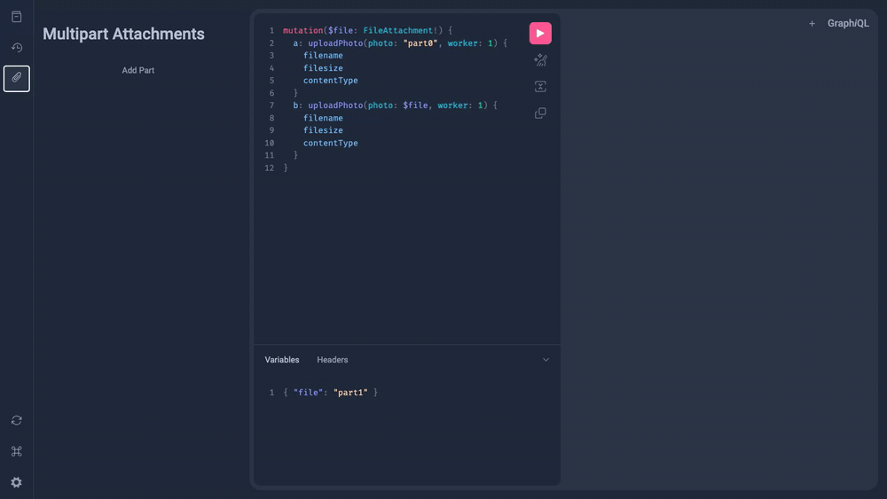

# Multipart Requests Plugin

This plugin allows GraphiQL to include files as part of a request to a GraphQL server
implementing [GraphQL Multipart Request: V3](https://workday.github.io/graphql-multipart-request-spec/graphql-multipart-request-v3.html).



## Usage

### Using `MultipartFetcher`
```tsx
import {
  MULTIPART_ATTACHMENTS_GRAPHIQL_PLUGIN,
  MultipartAttachmentsContext,
  MultipartAttachmentsProvider,
} from '@workday/graphiql-plugin-multipart-requests';

function GraphiQLWrapper() {
  const attachments = useContext(MultipartAttachmentsContext);

  const fetcher = useMemo(() => {
    // The decoratedFetcher will automatically pass all necessary FormData to the Fetcher
    return attachments.decoratedFetcher(
      async (graphQLParams: FetcherParams, formData: FormData | null) => {
        console.log('Attachments:', formData);
        
        // Send the request to the server 
      }
    );
  }, [attachments]);

  return (
    <GraphiQL
      fetcher={fetcher}
      plugins={[MULTIPART_ATTACHMENTS_GRAPHIQL_PLUGIN]}
    />
  );
}

const App = () => (
  <MultipartAttachmentsProvider>
    <GraphiQLWrapper />
  </MultipartAttachmentsProvider>
);
```

### Using `fetch` Override

```tsx
import {
  MULTIPART_ATTACHMENTS_GRAPHIQL_PLUGIN,
  MultipartAttachmentsContext,
  MultipartAttachmentsProvider
} from '@workday/graphiql-plugin-multipart-requests';

function GraphiQLWrapper() {
  const attachments = useContext(MultipartAttachmentsContext);

  const fetcher = useMemo(() => {
    // attachmentsFetch will automatically include all necessary FormData in the downstream request.
    const attachmentsFetch = attachments.decoratedFetch();
    async (graphQLParams: Fetcher) => {
      const response = await attachmentsFetch('https://example.com/my-graphql', {
          method: 'POST',
          headers: {
            'Content-Type': 'application/json'
          },
          body: JSON.stringify(graphQLParams)
        }
      );

      // Return the response to GraphiQL
    };
  }, [attachments]);

  return (
    <GraphiQL
      fetcher={fetcher}
      plugins={[MULTIPART_ATTACHMENTS_GRAPHIQL_PLUGIN]}
    />
  );
}

const App = () => (
  <MultipartAttachmentsProvider>
    <GraphiQLWrapper />
  </MultipartAttachmentsProvider>
);
```
